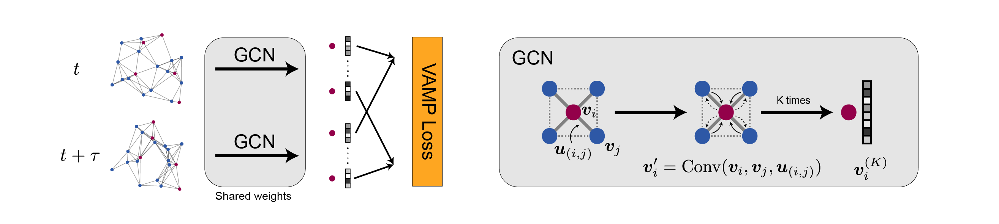

# Graph Dynamical Networks

This software package implements the Graph Dynamical Networks (GDyNet) that automatically learns atomic scale dynamics for materials from molecular dynamics trajectories. 

The following paper describes the details of the the method.

[Graph Dynamical Networks for Unsupervised Learning of Atomic Scale Dynamics in Materials](https://doi.org/10.1038/s41467-019-10663-6)



## Table of Contents

- [How to cite](#how-to-cite)
- [Prerequisites](#prerequisites)
- [Usage](#usage)
  - [Preprocess MD data](#preprocess-md-data)
  - [Training the model](#training-the-model)
  - [Visualize the results](#visualize-the-results)
- [Authors](#authors)
- [License](#license)

## How to cite

Please cite the following work if you want to use GDyNet.

```
@article{xie_graph_2019,
	title = {Graph dynamical networks for unsupervised learning of atomic scale dynamics in materials},
	volume = {10},
	issn = {2041-1723},
	url = {http://www.nature.com/articles/s41467-019-10663-6},
	doi = {10.1038/s41467-019-10663-6},
	language = {en},
	number = {1},
	urldate = {2019-06-19},
	journal = {Nature Communications},
	author = {Xie, Tian and France-Lanord, Arthur and Wang, Yanming and Shao-Horn, Yang and Grossman, Jeffrey C.},
	month = dec,
	year = {2019},
	pages = {2667}
}
```

##  Prerequisites

This package requires:

- [TensorFlow](https://www.tensorflow.org)
- [pymatgen](http://pymatgen.org)
- [tqdm](https://tqdm.github.io)

If you are new to Python, the easiest way of installing the prerequisites is via [conda](https://conda.io/docs/index.html). After installing [conda](http://conda.pydata.org/), run the following command to create a new [environment](https://conda.io/docs/user-guide/tasks/manage-environments.html) named `gdynet` and install all prerequisites:

```bash
conda upgrade conda
conda create -n gdynet python=3.6 tensorflow pymatgen tqdm -c anaconda -c matsci
```

This creates a conda environment for running GDyNet. Before using GDyNet, activate the environment by:

```bash
source activate gdynet
```

Then, in directory `gdynet`, you can test if all the prerequisites are installed properly by running:

```bash
python main.py -h
python preprocess.py -h
```

This should display the help messages for `main.py` and `preprocess.py`. If you find no error messages, it means that the prerequisites are installed properly.

After you finished using GDyNet, exit the environment by:

```bash
source deactivate
```

## Usage

### Preprocess MD data

The GdyNets use dynamically constructed graphs to represent the atomic structures of materials in the MD trajectories. Unfortunately, we can't construct the graphs during the neural network training process because the graph construction algorithm is slow. So, we provide a `preprocess.py` to construct graphs from the MD trajectories as a preprocessing step.

First, you need to prepare your MD trajectories into a `traj.npz` file using [`numpy.savez_compressed`](https://docs.scipy.org/doc/numpy/reference/generated/numpy.savez_compressed.html#numpy.savez_compressed). It has a dictionary-like data structure which can be queried for its list of arrays with fast IO. For a MD trajectory containing `N` atoms and `F` frames, the `traj.npz` file contains,

- `traj_coords`: `np.float` arrays with shape `(F, N, 3)`, stores the cartesian coordinates of each atom in each frame.
- `lattices`: `np.float` arrays with shape `(F, 3, 3)`, stores the lattice matrix of the simulation box in each frame. In the lattice matrix, each row represents a lattice vector.
- `atom_types`: `np.int` arrays with shape `(N,)`, stores the atomic number of each atom in the MD simulation.
- `target_index`: `np.int` arrays with shape `(n,)`, stores the indexes of the target atoms. (`n <= N`)

Then, you can use the `preprocess.py` to preprocess the `traj.npz`. It will create a `graph.npz` file that contains the dynamically constructed graphs.

```bash
python preprocess.py traj.npz graph.npz
```

Note that the graph construction is slow especially for large MD trajectories. There two different graph construction algorithms implemented. The default `--backend kdtree` has a linear scaling but only works for orthogonal simulation box. For non-orthogonal simulation, use flag `--backend direct` which has a quadratic scaling. You can also take advantage of the multiprocessing with flag `--n-workers`. For other flags, checkout the help information with `python preprocess.py -h`.

### Training the model

Before training the model, you should split your MD trajectory into three parts for training, validation, and testing. Then, following the steps in [preprocess MD data](#preprocess-md-data), you can construct graphs for these three trajectories and obtain `train-graph.npz`, `val-graph.npz`, and `test-graph.npz`.

Now, you can start to train a GDyNet model. To keep everything clean, we create a new folder `training` to store all the intermediate files.

```bash
mkdir training
```

Then, you can use the `main.py` to train your model.

```bash
python main.py --train-flist train-graph.npz --val-flist val-graph.npz --test-flist test-graph.npz --job-dir training/
```

There are several common issues that may prevent the training from success.

- If the loss becomes `NaN`, it usually means the learning rate is too high. Try decrease it with flag `--lr`.
- If there is GPU memory error, you may want to decrease the batch size with flag `-b`.
- Make sure that the `--mode` matches the graph construction algorithm.
- You can also try different `--n-classes`, `--tau`, `--atom-fea-len`, and `--n-conv` to get the best performance. For other flags, use `python main.py -h` for helps.

### Visualize the results

After the training, you can visualize the dynamical model using the functions in the [`postprocess`](gdynet/postprocess.py) module. We provide a [jupyter notebook](notebooks/visualization.ipynb) to demonstrate how to visualize the results for the toy system from the [paper](https://arxiv.org/abs/1902.06836).

## Authors

This software was primarily written by [Tian Xie](http://ww.txie.me) who was advised by [Prof. Jeffrey Grossman](https://dmse.mit.edu/faculty/profile/grossman).

The VAMP loss module is modified on top of the [VAMPnet](https://github.com/markovmodel/deeptime/tree/master/vampnet) project by A. Mardt, et al. The PeriodicKDTree module is modifed on top of the [periodic_kdtree](https://github.com/patvarilly/periodic_kdtree) project by P. Varilly. 

## License

Graph Dynamical Networks is released under the MIT license.
